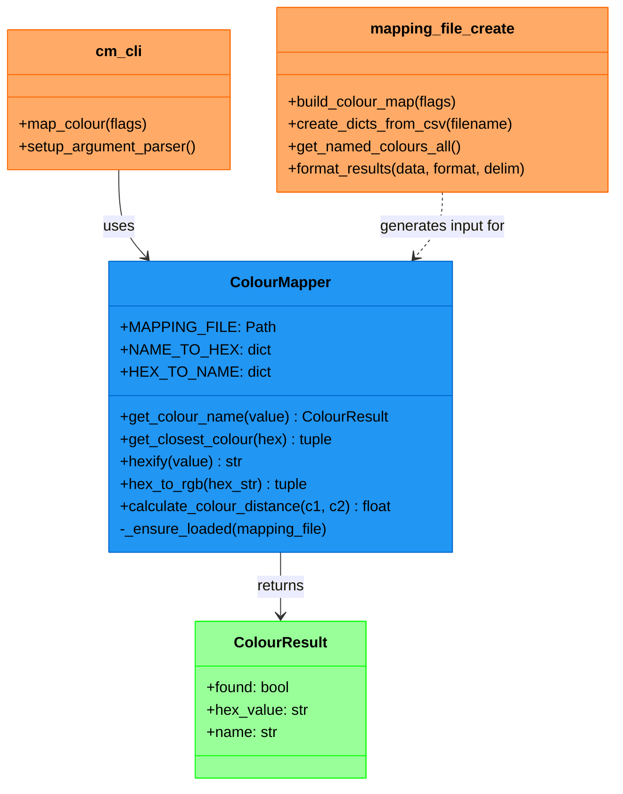
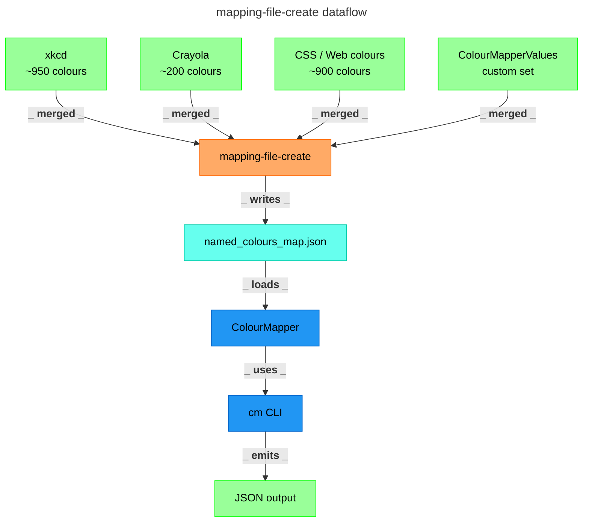
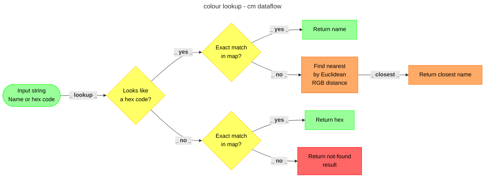

# colourmapper


[](https://github.com/astral-sh/ruff)
[](https://mypy-lang.org/)


A Python module plus convienence CLI tools for bidirectional colour name ↔ hex lookup, backed by a merged named colour (eg `burnt orange`) map built from multiple curated sources of colour name and their respective hex value. Contains approx 30K unique colours.

---

## What is it?

`colourmapper` is yet another simple solution that solves a common problem in code, design and data work<br>

> given a colour name, what is the hex code? and/or,<br> 
> given a hex code, what is the closest named colour for it?

As well as the [ColourMapper](src/colourmapper/ColourMapper.py) Module itself there are also included two simple CLI tools/scripts

| Tool | Purpose |
|------|---------|
| [`cm`](src/colourmapper/cm.py) | Look up a colour by a name and/or hex value |
| [`mapping-file-create`](src/colourmapper/mapping_file_create.py) | Regenerate the bundled named-colour map from included CSV sources plus others|

---

## Sample Module usage

```python
from colourmapper.ColourMapper import ColourMapper, ColourResult

mapper = ColourMapper()

result = mapper.get_colour_name("burnt orange")
# ColourResult(found=True, hex_value='#c04e01', name='burnt orange')

result = mapper.get_colour_name("#ededed")
# ColourResult(found=True, hex_value='#ededed', name='white edgar')

result = mapper.get_colour_name("#fe0003")
# ColourResult(found=True, hex_value='#ff0002', name='fire engine red')  -- nearest match
```

## Getting Started & Installation

### Prerequisites

- Python 3.12+

## Quick Start

```shell
git clone https://github.com/rondomondo/colourmapper
cd colourmapper
make check-venv
source .venv/bin/activate
make install
make test
make examples
```


<hr>

## Using the Python API

The primary way to use `colourmapper` is to import [ColourMapper.py](src/colourmapper/ColourMapper.py) directly in your own code.

```python
from colourmapper.ColourMapper import ColourMapper, ColourResult
```

### Quick usage example

```python
from colourmapper.ColourMapper import ColourMapper, ColourResult

mapper = ColourMapper()

result = mapper.get_colour_name("burnt orange")
# ColourResult(found=True, hex_value='#c04e01', name='burnt orange')

result = mapper.get_colour_name("#ededed")
# ColourResult(found=True, hex_value='#ededed', name='white edgar')

result = mapper.get_colour_name("#fe0003")
# ColourResult(found=True, hex_value='#ff0002', name='fire engine red')  -- nearest match
```

### `ColourMapper(mapping_file=None)`

Instantiates the mapper. On first call the bundled [named_colours_map.json](src/colourmapper/named_colours_map.json) is loaded and cached for all subsequent instances. Pass a custom `mapping_file` path (str or `Path`) to use your own colour map instead.

**Note:** you can always recreate the mapping file by running  [`mapping-file-create`](src/colourmapper/mapping_file_create.py) 

```python
mapper = ColourMapper()                          # use bundled map
mapper = ColourMapper("my_colours.json")         # use custom map
```

### `ColourResult`

All lookup methods return a `ColourResult` dataclass:

| Field | Type | Description |
|-------|------|-------------|
| `found` | `bool` | `True` if the colour was matched (exact or nearest) |
| `hex_value` | `str` | Canonical hex code e.g. `#c04e01` |
| `name` | `str` | Human-readable colour name, lower-cased |

### `get_colour_name(value: str) -> ColourResult`

The main lookup method. Accepts a colour name or any valid hex code (with or without `#`, short or long form). Lookup order:

1. Exact name match (case-insensitive, spaces optional)
2. Exact hex match
3. Nearest colour by Euclidean RGB distance

```python
mapper.get_colour_name("DarkRed")    # by name, case-insensitive
mapper.get_colour_name("darkred")    # spaces are optional too
mapper.get_colour_name("#8b0000")    # by hex
mapper.get_colour_name("8b0000")     # hash prefix is optional
mapper.get_colour_name("#f00")       # shorthand hex expanded automatically
mapper.get_colour_name("#FE0001")    # no exact match -- returns nearest
```

Note: American-spelling alias: `get_color_name(value)` behaves identically

### `get_closest_colour(hex_colour: str) -> tuple[str, str]`

Finds the closest named colour to any hex code by [Euclidean RGB distance](https://en.wikipedia.org/wiki/Color_difference#Euclidean). Returns `(hex_code, name)`. Useful when you know the input is a hex value and want the nearest named match regardless of whether an exact entry exists.

```python
hex_code, name = ColourMapper.get_closest_colour("#7F007F")
# ('#7f007f', 'purple')
```

Note: American-spelling alias: `get_closest_color(hex_colour)`.

### `hexify(value: str) -> str | None`

Normalises any hex string to canonical `#rrggbb` lowercase form. Returns `None` for invalid input. Can be called without an instance.

```python
ColourMapper.hexify("#FFF")     # -> '#ffffff'
ColourMapper.hexify("FF0000")     # -> '#ff0000'
ColourMapper.hexify("not-a-hex")  # -> None
```

### Custom colour map files

Supply your own JSON file -- a flat object of `"name": "#hexvalue"` pairs -- to extend or replace the bundled map:

```python
# will extend the initial map
mapper = ColourMapper("path/to/my_colours.json")
result = mapper.get_colour_name("my custom colour")
```

### Error handling

If the mapping file cannot be found or read, a `ColourMapper.MissingMappingFile` (subclass of `IOError`) is raised:

```python
from colourmapper.ColourMapper import ColourMapper

try:
    mapper = ColourMapper("missing.json")
except ColourMapper.MissingMappingFile as e:
    print(e)
```

---

## Available CLI Commands

Run `make help` to see all available commands.

---

## [`cm`](src/colourmapper/cm.py) — colour lookup CLI 

Run `cm -h` to see all available options.

### Look up a colour by name or hex value

```shell
cm "burnt orange"
```

```json
{
  "found": true,
  "hex_value": "#c04e01",
  "name": "burnt orange"
}
```

### Look up a colour by hex

```shell
cm '#ededed'
```

```json
{
  "found": true,
  "hex_value": "#ededed",
  "name": "very light grey"
}
```

Short hex codes are expanded automatically:

```shell
cm '#fff'
```

### Open a colour preview in the browser

Pass `--url` to include a direct link to a colour preview page ([color-hex.com](https://www.color-hex.com/color/)):

```shell
cm --url "burnt orange"
```

```json
{
  "found": true,
  "hex_value": "#c04e01",
  "name": "burnt orange",
  "url": "https://www.color-hex.com/color/c04e01"
}
```

Open the URL in any browser to see a full colour swatch, complementary colours, RGB/HSL/HSV conversion values, and more.

### Inspect the Colour Map

```shell
# Print path to the bundled map file
cm --map-file

# Dump the full map as JSON
cm --dump-map-file
```

### Pipe to jq

All output is valid JSON:

```shell
cm "Sapphire" | jq '.hex_value'
# "#0f52ba"

cm --url '#3d9970' | jq '.url'
# "https://www.color-hex.com/color/3d9970"
```

---

## `mapping-file-create` — rebuild the colour map

The bundled `named_colours_map.json` is pre-built, but you can regenerate it at any time from the four included CSV sources.

### What is a named-colour map?

A named-colour map is a flat JSON object where every key is a human-readable colour name and every value is its canonical hex code:

```json
{
  "acid green":   "#8ffe09",
  "adobe":        "#bd6c48",
  "algae":        "#54ac68",
  "almond":       "#efdecd",
  "almost black": "#070d0d"
}
```

The `cm` tool loads this file on first use and uses it for all lookups.

### CSV source format

Each CSV has exactly three comma separated fields per row:
`display name`, `hex value`, `normalised name`

**xkcd.rgb.mapping.csv** (>1K crowd sourced colour names):

```
"acid green","#8ffe09","acid green"
"adobe","#bd6c48","adobe"
"algae green","#21c36f","algae green"
```

**crayola2.mapping.csv** (>200 Crayola Crayon names):

```
"Absolute Zero","#0048ba","absolute zero"
"Alien Armpit","#84de02","alien armpit"
"Alloy Orange","#c46210","alloy orange"
```

**colorNames.mapping.csv** (CSS / Web Colour registry, >1K names):

```
"Abbey","4c4f56","abbey"
"Aero Blue","c9ffe5","aero blue"
"Acapulco","7cb0a1","acapulco"
```

**ColourMapperValues.csv** (>5k custom curated set):

```
"100 Mph","#c93f38","100 mph"
"1989 Miami Hotline","#dd3366","1989 miami hotline"
```

After merging all four CSV sources, matplotlib's full named-colour set is added, giving a final map of approx 30K unique names.

### Running it

```shell
mapping-file-create
```

```json
{
  "count": 61051,
  "format": "json",
  "path": "/path/to/named_colours_map.json"
}
```

### Options

`mapping-file-create -h`

| Flag | Default | Description |
|------|---------|-------------|
| `-f` / `--file` | `named_colours_map.json` | Output filename stem |
| `--format` | `json` | Output format: `json`, `dict`, `list`, `csv` |
| `--print` | off | Emit the full map to stdout |
| `--dry-run` | off | Build but do not write (implies `--print`) |
| `-d` / `--delimiter` | `,` | Delimiter for `list`/`csv` formats |

### Output formats

| Format | Description | Example line |
|--------|-------------|--------------|
| `json` | Indented JSON object (default) | `"acid green": "#8ffe09"` |
| `dict` | Python dict literal | `'acid green': '#8ffe09'` |
| `list` | JSON array of `"name,hex"` strings | `"acid green,#8ffe09"` |
| `csv` | Plain CSV lines | `acid green,#8ffe09` |


---

## Examples

```shell
# Run the examples from the Makefile 
make examples
```

---

## Testing

```shell
# Run all tests
make test

```

Tests cover the following:

- Argument parser configuration for both CLIs
- `ColourMapper` name→hex and hex→name lookup plus API
- Nearest-colour matching by RGB distance
- Mapping file creation and formatting

---

## Tool Architecture



---

## Various Diagrams

### Core Components



### Colour lookup flow



--- 

## Demo


---

## Licence

[MIT](https://opensource.org/license/mit)
